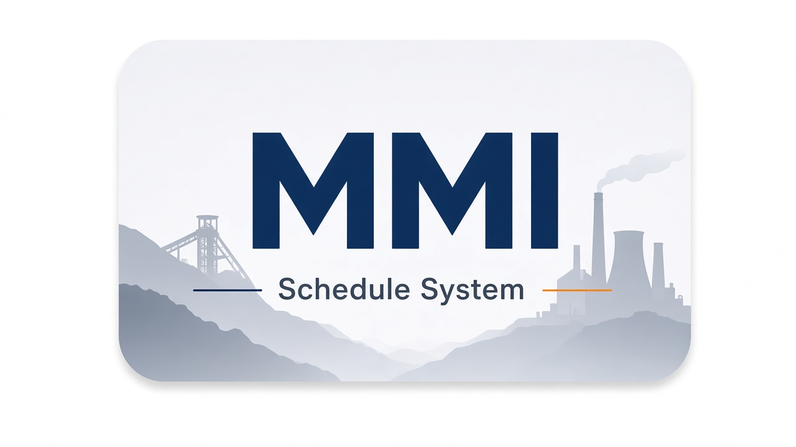

<p align="center">
  
</p>

# MMI Schedule System

Web-based system for importing monthly work schedules from Excel and providing each employee with a personal calendar view.

Employees log in with their internal work number and can view day/night shifts, leave, sick leave and rest days for any month.

Unofficial project for **Mini Maritsa Iztok 2 (MMI)**.

---

## Features

- **Excel import** — correctly parses the real MMI2 multi-block format
- **Personal calendar** — responsive monthly view with statistics and month navigation
- **Secure access** — work-number login + JWT; role-based admin panel (owner / admin / moderator) with scrypt password hashing
- **First-run installer** — web wizard for SQLite or PostgreSQL, Alembic migrations and owner account creation
- **REST API** — ready for a future native Android client
- **Docker & CI** — Docker Compose support and GitHub Actions for migrations + tests
- **Atomic imports** — schedule data and import history are written in a single transaction; SHA-256 fingerprint of every imported file
- **Self-update & diagnostics** — built-in update checker and system health tools

---

## Shift legend

| Excel code | Meaning              | API type      |
|------------|----------------------|---------------|
| `1`        | Day shift            | `day`         |
| `2`        | Night shift          | `night`       |
| `О` / `0`  | Leave                | `leave`       |
| `Б`        | Sick leave           | `sick_leave`  |
| *(empty)*  | Scheduled rest day   | `rest`        |

Any other value is stored as `unknown` (original code is preserved in `raw_code`).

---

## Quick start

### Local development

```bash
python -m venv .venv

# Windows
.venv\Scripts\activate
pip install -r requirements.txt
copy .env.example .env
python -m alembic upgrade head
uvicorn app.main:app --reload

# Linux / macOS
source .venv/bin/activate
pip install -r requirements.txt
cp .env.example .env
python -m alembic upgrade head
uvicorn app.main:app --reload
```

Then open:

- Application: http://localhost:8000
- Admin panel: http://localhost:8000/admin
- API docs (Swagger): http://localhost:8000/docs

### Docker

```bash
cp .env.example .env
docker compose up --build
```

### First-run web installer

If the application has not been installed yet, the first visit automatically redirects to `/install`.

The installer wizard:

1. Checks Python / Alembic and write permissions
2. Lets you choose SQLite or PostgreSQL
3. Tests the database connection and runs `alembic upgrade head`
4. Creates the single **owner** account
5. Generates a random JWT secret and writes `.env`
6. Locks the installer (`install/install.lock`)

> **Note on hosting:** Simply uploading files via FTP is not enough. The environment must be able to run a Python ASGI application (Passenger, systemd + uvicorn, Docker, etc.). When using PostgreSQL the database itself must already exist; the installer only creates the tables and indexes.

More details: [`install/README.md`](install/README.md)

---

## Architecture

```text
Excel (.xlsx)
    │
    ├── period detector
    ├── preview (no write)
    └── confirm import
            ├── Employee   (work_number, full_name, team А/Б/В/Г)
            ├── ShiftEntry (date, type, raw_code)
            └── ImportHistory (filename, counts, SHA-256, conflicts)

Employee data
    ├── Web calendar
    └── REST API  ──►  Android app (future)
```

**Stack:** FastAPI · SQLAlchemy · Alembic · OpenPyXL · JWT · scrypt

---

## Admin roles

| Role         | Permissions |
|--------------|-------------|
| **owner**    | Full access. Only the owner can manage admin/moderator accounts. The owner account cannot be demoted or deactivated through the supported UI/API. |
| **admin**    | Preview & import, manual corrections, employee metadata, import history and audit history. No account management. |
| **moderator**| Preview & import, employee search, editing of daily shift entries. Cannot change name or permanent team. No history or account management. |

---

## API overview

| Method | Endpoint | Description |
|--------|----------|-------------|
| `POST` | `/api/v1/auth/login` | Login with `{"work_number": "12345"}` |
| `GET`  | `/api/v1/me` | Current employee (Bearer token) |
| `GET`  | `/api/v1/me/schedule/{year}/{month}` | Monthly schedule |
| `POST` | `/api/v1/admin/preview` | Excel preview (multipart) |
| `POST` | `/api/v1/admin/import` | Confirmed import |
| `GET`  | `/api/v1/admin/imports` | Import history |

Full interactive documentation is available at `/docs`. Additional details can be found in the [`docs/`](docs/) folder.

---

## Documentation

- [Admin accounts](docs/admin-accounts.md)
- [Database migrations](docs/database-migrations.md)
- [Employee API](docs/employee-api.md)
- [Hosting & deployment](docs/hosting-deployment.md)
- [Import behavior](docs/import-behavior.md)
- [Real Excel format](docs/real-excel-format.md)
- [Self-update](docs/self-update.md)
- [System diagnostics](docs/system-diagnostics.md)
- [Update checker](docs/update-checker.md)

---

## Tests & CI

```bash
pytest
```

GitHub Actions automatically runs database migrations and the test suite on every push.

---

## License

Copyright (c) 2025-2026 **Dr. Necrotix (NIKO)**  
All rights reserved.

This software was created and is owned by Dr. Necrotix (NIKO).  
See the [LICENSE](LICENSE) file for full terms.
